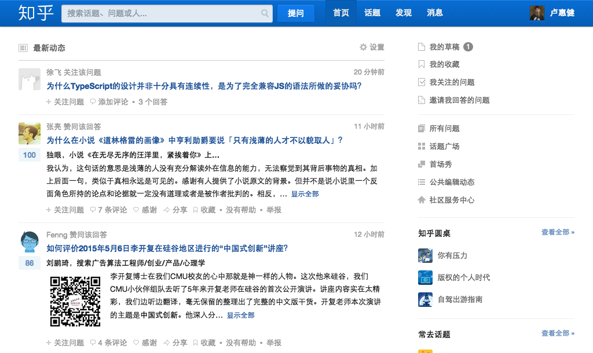

# bootstrap之知乎网实践
## 结构  
* 导航  
	- logo
	- 搜索
	- nav导航
	- 用户名（移上去下拉列表）
		+  我的主页
		+  私信
		+  设置
		+  退出
* 最新动态（左栏）
	- 头部
		+ 最新动态
		+ 设置
	- 最新动态列表
		+ 用户相关（头像，用户名，移到用户头像会显示用户详情信息）
		+ 点赞
		+ 最新一条动态标题和内容
		+ 关注问题，多少条评论
		+ 每条动态记录是一个alert,用户可以自己删除。
* 侧边栏（右栏）
	- 列表一
		+ 内容（我的草稿，我的收藏，我关注的问题，邀请我回答的问题）
		+ 徽章提示
	- 列表二（你感兴趣的人）
		+ 更多推荐
		+ 感兴趣的人（头像，人名，简介）
		+ alert提示控件

## 要求
* 美观，界面风格自定义。
* 能用bootstrap提供js组件实现动态交互（根据个人能力而定）。
* 基本响应式，支持pc，ipad(横竖屏），手机。  

#### pc&ipad横屏

#### ipad竖屏
  

#### phone
 

